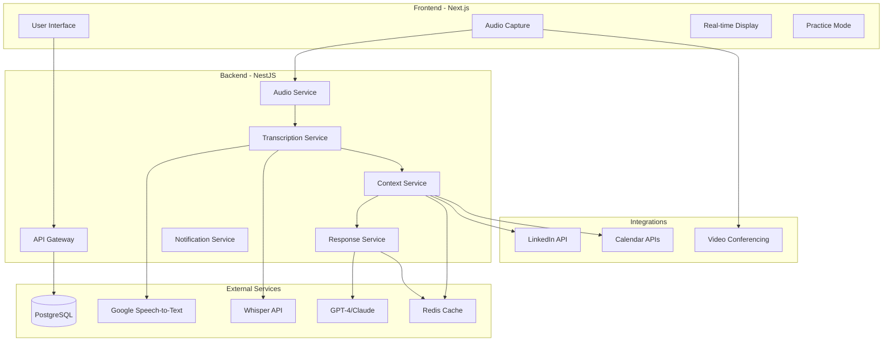

# Design Document

## Overview

La aplicación de IA para entrevistas por videoconferencia utiliza una arquitectura de microservicios distribuida que separa claramente las responsabilidades entre captura de audio, procesamiento de transcripción, análisis contextual y generación de respuestas. El sistema está diseñado para optimizar la latencia end-to-end manteniendo alta precisión y escalabilidad.

La arquitectura híbrida combina procesamiento en tiempo real para respuesta inmediata con refinamiento posterior para máxima precisión, utilizando múltiples proveedores de IA y técnicas de optimización avanzadas.

## Architecture

### High-Level Architecture



### Technology Stack

**Frontend:**
- Next.js 14 con App Router
- TypeScript para type safety
- Tailwind CSS para styling
- Socket.IO client para real-time
- Web Audio API para captura
- WebRTC para streaming avanzado

**Backend:**
- NestJS con TypeScript
- Socket.IO para WebSocket connections
- Bull Queue para procesamiento asíncrono
- Prisma ORM para database access
- Redis para caching y sessions
- PostgreSQL para persistent data

**AI/ML Services:**
- Google Speech-to-Text Streaming API
- OpenAI Whisper para refinamiento
- GPT-4 Turbo para generación de respuestas
- Claude 3 como fallback LLM

## Components and Interfaces

### Audio Capture Component

**Responsabilidades:**
- Detectar y configurar fuentes de audio disponibles
- Manejar permisos del navegador
- Streaming de audio en tiempo real
- Fallback automático entre métodos

**Interface:**
```typescript
interface AudioCaptureService {
  detectAvailableSources(): Promise<AudioSource[]>
  selectAudioSource(sourceId: string): Promise<MediaStream>
  startCapture(config: CaptureConfig): Promise<AudioStream>
  stopCapture(): Promise<void>
  onAudioData(callback: (chunk: AudioChunk) => void): void
}

interface AudioSource {
  id: string
  type: 'microphone' | 'system' | 'webrtc' | 'plugin'
  name: string
  isAvailable: boolean
  requiresPermission: boolean
}
```

### Transcription Service

**Responsabilidades:**
- Procesamiento híbrido de audio a texto
- Gestión de latencia vs precisión
- Detección de confianza y calidad
- Diarización básica de hablantes

**Interface:**
```typescript
interface TranscriptionService {
  transcribeRealTime(audioStream: AudioStream): Observable<TranscriptionResult>
  refineTranscription(audioChunk: AudioChunk): Promise<RefinedTranscription>
  detectSpeakers(audioChunk: AudioChunk): Promise<SpeakerInfo[]>
  getConfidenceScore(transcription: string): number
}

interface TranscriptionResult {
  text: string
  confidence: number
  isFinal: boolean
  timestamp: number
  speakerId?: string
}
```

### Context Analysis Service

**Responsabilidades:**
- Análisis del perfil del usuario
- Extracción de contexto del puesto
- Clasificación de preguntas
- Mantenimiento del historial de conversación

**Interface:**
```typescript
interface ContextService {
  analyzeUserProfile(userId: string): Promise<UserProfile>
  extractJobContext(jobDescription: string): Promise<JobContext>
  classifyQuestion(question: string): Promise<QuestionClassification>
  updateConversationHistory(interaction: Interaction): Promise<void>
  getRelevantContext(question: string): Promise<ContextData>
}

interface QuestionClassification {
  type: 'technical' | 'behavioral' | 'situational' | 'cultural'
  category: string
  difficulty: 'junior' | 'mid' | 'senior'
  requiresSTAR: boolean
}
```

### Response Generation Service

**Responsabilidades:**
- Generación de respuestas contextualizadas
- Aplicación de templates y estructuras
- Personalización basada en perfil
- Múltiples opciones de respuesta

**Interface:**
```typescript
interface ResponseService {
  generateResponses(
    question: string, 
    context: ContextData, 
    profile: UserProfile
  ): Promise<ResponseOption[]>
  
  applySTARStructure(content: string, experience: Experience[]): Promise<string>
  personalizeResponse(template: string, profile: UserProfile): Promise<string>
  validateResponseLength(response: string): boolean
}

interface ResponseOption {
  id: string
  content: string
  structure: 'STAR' | 'direct' | 'technical'
  estimatedDuration: number
  confidence: number
  tags: string[]
}
```

## Data Models

### Core Entities

```typescript
// User and Profile
interface User {
  id: string
  email: string
  name: string
  createdAt: Date
  subscription: SubscriptionTier
}

interface UserProfile {
  userId: string
  experience: Experience[]
  skills: Skill[]
  industries: string[]
  seniority: 'junior' | 'mid' | 'senior' | 'lead'
  preferences: UserPreferences
}

interface Experience {
  company: string
  role: string
  duration: string
  achievements: string[]
  technologies: string[]
}

// Interview Session
interface InterviewSession {
  id: string
  userId: string
  jobContext: JobContext
  startTime: Date
  endTime?: Date
  status: 'active' | 'paused' | 'completed'
  interactions: Interaction[]
  settings: SessionSettings
}

interface Interaction {
  id: string
  sessionId: string
  timestamp: Date
  question: string
  questionType: QuestionClassification
  responses: ResponseOption[]
  selectedResponse?: string
  userFeedback?: number
}

// Job and Company Context
interface JobContext {
  title: string
  company: string
  description: string
  requirements: string[]
  companyValues: string[]
  interviewType: 'technical' | 'behavioral' | 'mixed'
  seniority: string
}
```

### Database Schema

```sql
-- Users and Authentication
CREATE TABLE users (
  id UUID PRIMARY KEY DEFAULT gen_random_uuid(),
  email VARCHAR(255) UNIQUE NOT NULL,
  name VARCHAR(255) NOT NULL,
  subscription_tier VARCHAR(50) DEFAULT 'free',
  created_at TIMESTAMP DEFAULT NOW(),
  updated_at TIMESTAMP DEFAULT NOW()
);

-- User Profiles
CREATE TABLE user_profiles (
  id UUID PRIMARY KEY DEFAULT gen_random_uuid(),
  user_id UUID REFERENCES users(id) ON DELETE CASCADE,
  seniority VARCHAR(50),
  industries JSONB,
  skills JSONB,
  experience JSONB,
  preferences JSONB,
  created_at TIMESTAMP DEFAULT NOW(),
  updated_at TIMESTAMP DEFAULT NOW()
);

-- Interview Sessions
CREATE TABLE interview_sessions (
  id UUID PRIMARY KEY DEFAULT gen_random_uuid(),
  user_id UUID REFERENCES users(id) ON DELETE CASCADE,
  job_context JSONB,
  status VARCHAR(50) DEFAULT 'active',
  settings JSONB,
  started_at TIMESTAMP DEFAULT NOW(),
  ended_at TIMESTAMP,
  created_at TIMESTAMP DEFAULT NOW()
);

-- Interactions and Responses
CREATE TABLE interactions (
  id UUID PRIMARY KEY DEFAULT gen_random_uuid(),
  session_id UUID REFERENCES interview_sessions(id) ON DELETE CASCADE,
  question TEXT NOT NULL,
  question_classification JSONB,
  generated_responses JSONB,
  selected_response TEXT,
  user_feedback INTEGER CHECK (user_feedback >= 1 AND user_feedback <= 5),
  timestamp TIMESTAMP DEFAULT NOW()
);

-- Analytics and Metrics
CREATE TABLE session_metrics (
  id UUID PRIMARY KEY DEFAULT gen_random_uuid(),
  session_id UUID REFERENCES interview_sessions(id) ON DELETE CASCADE,
  transcription_latency_ms INTEGER,
  response_generation_ms INTEGER,
  total_latency_ms INTEGER,
  transcription_accuracy DECIMAL(5,2),
  user_satisfaction INTEGER,
  created_at TIMESTAMP DEFAULT NOW()
);
```

## Error Handling

### Error Categories and Strategies

**Audio Capture Errors:**
- Permission denied → Mostrar instrucciones claras, ofrecer alternativas
- Device not found → Auto-detect y fallback a dispositivos disponibles
- Stream interruption → Reconexión automática con notificación al usuario

**Transcription Errors:**
- API timeout → Fallback a servicio alternativo (Google → Whisper)
- Low confidence → Mostrar indicador de incertidumbre, permitir re-transcripción
- Rate limiting → Queue management y throttling inteligente

**Response Generation Errors:**
- LLM API failure → Fallback a modelo alternativo (GPT-4 → Claude)
- Context missing → Usar respuestas genéricas con disclaimer
- Response too long → Auto-truncate con opción de expandir

**Implementation:**
```typescript
class ErrorHandler {
  async handleAudioError(error: AudioError): Promise<AudioRecoveryAction> {
    switch (error.type) {
      case 'PERMISSION_DENIED':
        return {
          action: 'SHOW_INSTRUCTIONS',
          fallback: 'MANUAL_UPLOAD',
          message: 'Por favor, permite acceso al micrófono...'
        }
      case 'DEVICE_NOT_FOUND':
        return {
          action: 'AUTO_DETECT',
          fallback: 'DEFAULT_DEVICE',
          message: 'Detectando dispositivos disponibles...'
        }
    }
  }

  async handleTranscriptionError(error: TranscriptionError): Promise<void> {
    if (error.type === 'API_TIMEOUT') {
      await this.switchToFallbackSTT()
    }
  }
}
```

## Testing Strategy

### Unit Testing
- **Audio Services**: Mock MediaStream APIs, test device detection
- **Transcription**: Mock STT APIs, test confidence scoring
- **Context Analysis**: Test question classification accuracy
- **Response Generation**: Validate STAR structure, length limits

### Integration Testing
- **End-to-end Pipeline**: Audio → Transcription → Response (< 2s)
- **API Integration**: Test all external service integrations
- **WebSocket Communication**: Real-time data flow validation
- **Database Operations**: CRUD operations and data integrity

### Performance Testing
- **Latency Benchmarks**: Measure each pipeline stage
- **Concurrent Users**: Test WebSocket scalability
- **Memory Usage**: Audio streaming and processing efficiency
- **API Rate Limits**: Graceful degradation under load

### User Acceptance Testing
- **Real Interview Scenarios**: Test with actual interview questions
- **Cross-browser Compatibility**: Chrome, Firefox, Safari, Edge
- **Device Compatibility**: Different microphones and audio setups
- **Accessibility**: Screen readers, keyboard navigation

### Testing Implementation
```typescript
// Example test structure
describe('Interview Pipeline', () => {
  it('should process audio to response within 2 seconds', async () => {
    const startTime = Date.now()
    const audioChunk = mockAudioData()
    
    const result = await interviewPipeline.process(audioChunk)
    const endTime = Date.now()
    
    expect(endTime - startTime).toBeLessThan(2000)
    expect(result.transcription).toBeDefined()
    expect(result.responses).toHaveLength.greaterThan(0)
  })

  it('should maintain >95% transcription accuracy', async () => {
    const testCases = loadTranscriptionTestCases()
    const results = await Promise.all(
      testCases.map(test => transcriptionService.transcribe(test.audio))
    )
    
    const accuracy = calculateWER(testCases, results)
    expect(accuracy).toBeGreaterThan(0.95)
  })
})
```

### Monitoring and Analytics
- **Real-time Metrics**: Latency, accuracy, user satisfaction
- **Error Tracking**: Sentry integration for production monitoring
- **Usage Analytics**: Feature adoption, session duration, conversion rates
- **Performance Dashboards**: Grafana dashboards for system health